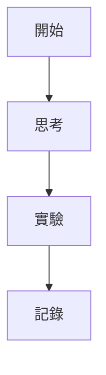

# 部落格 Docker 使用指南

## 🚀 快速開始

### 1. 啟動部落格

```bash
docker-compose up -d
```

啟動後，您的部落格將在以下網址可供訪問：
- **主網址**：http://localhost:4000
- **LiveReload**：自動啟用，修改檔案後瀏覽器會自動重新載入

### 2. 查看日誌

```bash
docker-compose logs -f
```

這會顯示 Jekyll 的即時日誌，幫助您了解建置狀態和錯誤訊息。

### 3. 停止部落格

```bash
docker-compose down
```

### 4. 重新建置（當修改 Dockerfile 或 Gemfile 時）

```bash
docker-compose down
docker-compose build --no-cache
docker-compose up -d
```

---

## 📁 部落格目錄結構

```
frank-lee-notes/
├── _config.yml          # 部落格主要配置檔
├── _posts/              # 部落格文章目錄
│   └── YYYY-MM-DD-title.md
├── _pages/              # 獨立頁面（關於、聯絡等）
├── _includes/           # 可重複使用的組件
├── _layouts/            # 頁面佈局模板
├── assets/              # 靜態資源（圖片、CSS、JS）
├── Dockerfile           # Docker 映像配置
├── docker-compose.yml   # Docker 服務配置
└── LICENSE-CONTENT.md   # 版權宣告
```

---

## ✍️ 撰寫新文章

### 文章命名規則

在 `_posts/` 目錄中創建新文件，檔名必須遵循以下格式：

```
YYYY-MM-DD-title.md
```

例如：`2026-02-05-my-first-post.md`

### 文章前置資料（Front Matter）

每篇文章開頭必須包含 YAML 前置資料：

```markdown
---
title: 我的第一篇文章
author: Frank Lee
date: 2026-02-05
category: 思考
layout: post
---

這裡開始寫文章內容...
```

### 可選配置

```yaml
---
title: 文章標題
author: Frank Lee
date: 2026-02-05
category: 分類名稱
layout: post
cover: /assets/images/cover.jpg  # 封面圖片（可選）
mermaid: true                     # 啟用圖表（可選）
---
```

---

## 🎨 自訂設定

### 修改網站資訊

編輯 `_config.yml`：

```yaml
title:            法蘭克李的筆記本
longtitle:        Frank Lee's Notes - 法蘭克李的筆記本
author:           Frank Lee
email:            your-email@example.com
description: >
  這個部落格收集自己一些思考實驗與筆記
```

**注意**：修改 `_config.yml` 後需要重啟 Docker 容器：

```bash
docker-compose restart
```

### 啟用目錄（TOC）

在文章的前置資料中已預設啟用，您也可以在 `_config.yml` 中全域設定：

```yaml
toc:
  enabled: true
  h_min: 1
  h_max: 3
```

---

## 📊 進階功能

### 使用 Mermaid 圖表

在文章前置資料中設定 `mermaid: true`，然後：

````markdown

````

### 添加提示區塊

```markdown
> ##### TIP
>
> 這是一個提示訊息
{: .block-tip }

> ##### WARNING
>
> 這是一個警告訊息
{: .block-warning }

> ##### DANGER
>
> 這是一個危險訊息
{: .block-danger }
```

---

## 📄 版權宣告

本部落格採用 **CC BY-NC-SA 4.0** 授權，詳見 [LICENSE-CONTENT.md](LICENSE-CONTENT.md)：

- ✅ 允許分享和改編（需註明出處）
- ❌ 禁止商業使用
- 🔄 改編作品必須使用相同授權

---

## 🐛 常見問題

### Q: 修改文章後沒有自動重新載入？

A: 確認 LiveReload 正常運作：
1. 檢查控制台是否有錯誤訊息
2. 手動刷新瀏覽器（Cmd+R / Ctrl+R）
3. 查看 Docker 日誌：`docker-compose logs -f`

### Q: 容器無法啟動？

A: 檢查端口是否被佔用：
```bash
lsof -i :4000
```

如果端口被佔用，可以修改 `docker-compose.yml` 中的端口映射。

### Q: 如何添加圖片？

A: 將圖片放在 `assets/images/` 目錄下，然後在文章中引用：
```markdown

```

---

## 🚀 部署到 GitHub Pages

當您準備好部署時：

1. 確認 `_config.yml` 中的 `url` 和 `baseurl` 設定正確
2. 將更改推送到 GitHub
3. 在 GitHub repo 設定中啟用 GitHub Pages
4. 選擇分支（通常是 `main` 或 `gh-pages`）

---

## 📚 更多資源

- [Jekyll 官方文檔](https://jekyllrb.com/docs/)
- [Jekyll Gitbook 主題](https://github.com/sighingnow/jekyll-gitbook)
- [Markdown 語法指南](https://www.markdownguide.org/)
- [CC BY-NC-SA 4.0 授權說明](https://creativecommons.org/licenses/by-nc-sa/4.0/)

---

祝您寫作愉快！🎉
