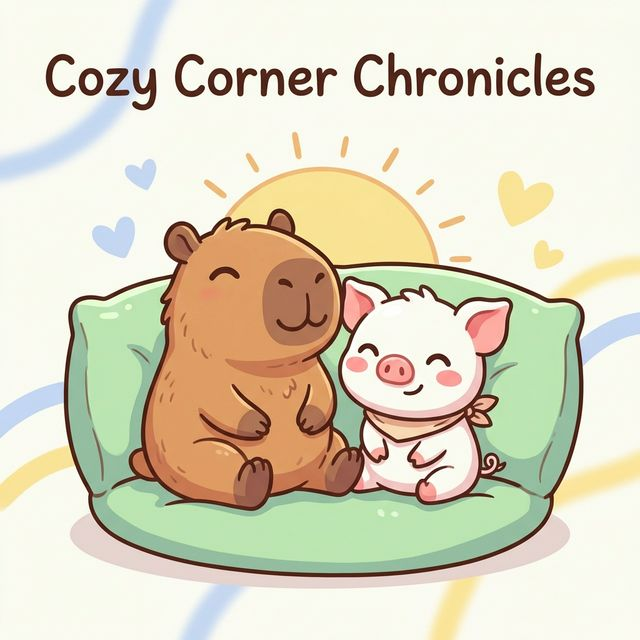

  

# 👋 嗨，歡迎來到我的筆記本！

我是 **Frank Lee**，一個記錄生活與思考的觀察者，外加一點思考實驗。

這裡是我的思想集散地，收集著各種好奇心驅使下的探索、學習和反思。

---

## 🌟 我相信的事

在這個快速變化的世界裡，我堅持著幾個簡單的原則：

- 🔍 **保持好奇心** - 對世界保持孩子般的好奇，不停地問「為什麼」
- 🌈 **跨領域學習** - 在不同領域間穿梭，尋找有趣的連結
- 🔄 **實踐與反思** - 不只是想，更要做；不只是做，更要想
- 💬 **開放與分享** - 知識因分享而增值，思想因交流而深化

---

## 📚 你會在這裡看到什麼？

這個筆記本記錄著我在不同領域的探索：

### 🏥 中醫學習筆記
傳統醫學的智慧與現代思維的碰撞

### 🤖 AI 相關文章
人工智慧時代的觀察、學習與實驗  
（包括 AI 協助產出的內容搜集）

### 📖 閱讀心得
書本帶來的啟發與思考

### 🌱 生活觀察與思考
日常中的小發現、大哲理

---

## 💭 關於思考實驗

我喜歡做一些思考實驗，在腦子裡建構各種「如果...會怎樣」的場景。這些實驗可能關於技術、醫學、哲學，或是生活中的任何事。

有時候這些實驗會帶來有趣的發現，有時候只是證明了我想錯了——但無論如何，都是很好玩的過程！

---

## 🤝 一起交流吧

這個部落格採用 **[CC BY-NC-SA 4.0](./LICENSE-CONTENT.md)** 授權：
- ✅ 歡迎分享和引用（請註明出處）
- ❌ 請勿用於商業用途
- 🔄 改編請用相同授權

如果你對某個主題有想法，或是想一起討論什麼，歡迎透過 [Contact](./pages/contact/) 聯繫我！

---

  
「學習的樂趣在於探索，而不在於到達。」

  
— 這個筆記本會持續更新，就像思考永不停歇 ✨

