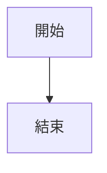

# 範例文章存檔

這個資料夾包含了 Jekyll Gitbook 主題的原始範例文章，供學習和參考使用。

## 📚 範例文章列表

這些文章展示了 Jekyll Gitbook 主題的各種功能：

### 基礎功能
- **2019-04-27-why.md** - 為什麼選擇 Jekyll with GitBook
- **2019-04-28-howto.md** - 如何開始使用
- **2019-04-29-license.md** - 授權說明

### 進階功能
- **2021-08-10-toc.md** - 目錄（TOC）生成功能
- **2022-05-24-page_cover.md** - 頁面封面圖片功能
- **2022-06-26-wide_tables.md** - 寬表格顯示
- **2022-06-30-tips_warnings_dangers.md** - 提示、警告和危險區塊
- **2023-08-31-mermaid.md** - Mermaid 圖表功能
- **2023-10-14-math-latex.md** - 數學公式（LaTeX）支援
- **2023-12-12-footnotes.md** - 腳註功能

## 💡 如何使用這些範例

### 查看範例內容
這些檔案可以作為參考，學習如何使用各種 Jekyll Gitbook 功能。

### 恢復某個範例到部落格
如果您想將某個範例重新發布到部落格上：

```bash
# 將範例複製回 _posts 資料夾
cp _examples/2023-08-31-mermaid.md _posts/

# 或者移動回去（會從範例中移除）
mv _examples/2023-08-31-mermaid.md _posts/
```

### 測試某個功能
您可以直接複製範例中的語法到您自己的文章中使用。

## 🔖 實用功能參考

### Mermaid 圖表
參考：`2023-08-31-mermaid.md`

在文章 front matter 加入 `mermaid: true`，然後使用：
````markdown

````

### 提示區塊
參考：`2022-06-30-tips_warnings_dangers.md`

```markdown
> ##### TIP
>
> 提示內容
{: .block-tip }
```

### 數學公式
參考：`2023-10-14-math-latex.md`

使用 LaTeX 語法：
```markdown
$$
E = mc^2
$$
```

### 腳註
參考：`2023-12-12-footnotes.md`

```markdown
這是一段文字[^1]。

[^1]: 這是腳註內容。
```

---

## 📝 注意事項

- 這些文章保存在 `_examples/` 資料夾中，**不會**出現在您的部落格上
- 如果您修改了 Jekyll 配置中的 `exclude` 設定，請確保 `_examples` 資料夾被排除
- 這些範例使用英文撰寫，您可以參考語法並用中文撰寫自己的文章

---

*這些範例來自 [Jekyll Gitbook 主題](https://github.com/sighingnow/jekyll-gitbook) 官方專案*
